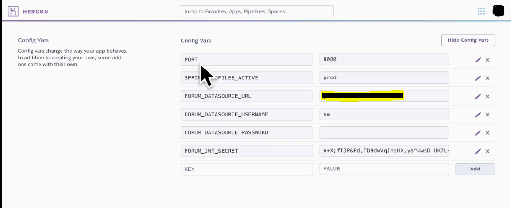

# Spring REST - Completo
Aplicação Spring REST completa: CRUD, JWT e Docker

##Arquivo Dockerile
```
FROM openjdk:11
ARG JAR_FILE=target/*.jar
COPY ${JAR_FILE} app.jar
ENTRYPOINT ["java","-Xmx512m","-jar","/app.jar"]
```

###Comando para gerar imagem
```
docker build -t nomedaaplicação .
```

###Comando para executar docker com variáveis de ambiente
```
docker run -p 8080:8080 -e SPRING_PROFILES_ACTIVE='prod' -e FORUM_DATABASE_URL='url do banco de dados' -e 
FORUM_DATABASE_USERNAME='usuario' -e FORUM_DATABASE_PASSWORD='senha' -e FORM_JWT_SECRET='secret do jwt' nomedaaplicação
```

### Comandos Heroku
```
heroku login
```
```
heroku create forum-marcio
```
```
heroku git:remote -a forum-marcio
```
## Configurar variáveis de ambiente no Heroku


```
heroku container:push web
```